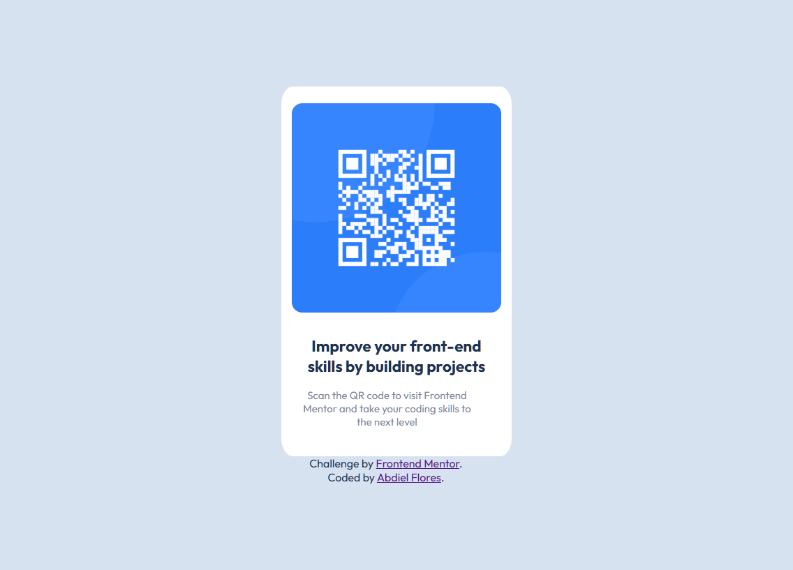

# Frontend Mentor - QR code component solution

This is a solution to the [QR code component challenge on Frontend Mentor](https://www.frontendmentor.io/challenges/qr-code-component-iux_sIO_H). Frontend Mentor challenges help you improve your coding skills by building realistic projects.

## Table of contents

- [Overview](#overview)
  - [Screenshot](#screenshot)
  - [Links](#links)
- [My process](#my-process)
  - [Built with](#built-with)
  - [What I learned](#what-i-learned)
  - [Continued development](#continued-development)
  - [Useful resources](#useful-resources)
- [Author](#author)
- [Acknowledgments](#acknowledgments)

**Note: Delete this note and update the table of contents based on what sections you keep.**

## Overview

### Screenshot



### Links

- Solution URL: [Add solution URL here](https://github.com/abdiel-code/qr-code)
- Live Site URL: [Add live site URL here](https://abdiel-code.github.io/qr-code)

## My process

### Built with

- HTML5
- CSS3
- Flexbox
- Mobile-first design

### What I learned

I'm already an experienced full-stack developer but this project help me to remember my origins and practice some bases that are always really useful.

```css
@media screen and (min-width: 375px) {
  .qr-container {
    width: 300px;
    height: 500px;
  }
}
```

### Continued development

This is just a grain of a gigant mountain, I want to keep learning and improving, this first project is the start to help me how to improve my styles and my mobile responsiveness

### Useful resources

- [The Odin Project](https://www.theodinproject.com/) - This was the first course of my developer career, I really recommend it to improve all full-stack skills.

## Author

- Website - [Foxcoon.Studio](https://www.foxcoon.studio)
- Frontend Mentor - [@yourusername](https://www.frontendmentor.io/profile/abdiel-code)
